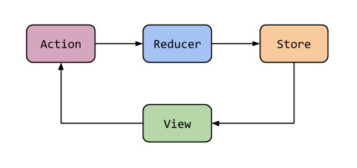

## Redux
### A CPA Global Presentation
---
# Overview

* Redux Basics
* Reducers
* Actions
* Selectors
* Effects

---

# Redux Basics

----
## Single state for the entire application
----
## State can only be altered via Actions
----
## Selectors allow components to recieve data and updates from the State
----
## Effects are launched off as a result of an action being dispatched. They perform actions, then dispatch another action when finished.  
----
## Actions launch off state changing events
----

---
# Reducers
----
## Reducers alter state based off actions recieved. 
----
## Essentially, a giant switch statement
----
## Takes an initial state
----
```javascript
import { Action, createReducer, on } from '@ngrx/store';
import { UserDetailActions } from '../actions';
import { UserDetailsState } from '../selectors/user-details.selector';

export const userDetailsFeatureKey = 'userDetails';

export const initialState: UserDetailsState = {
  loggedInUser: null,
  loaded: false
};

export const reducer = createReducer(
  initialState,
  on(UserDetailActions.GET_OR_LOAD, state => ({
    ...state
  })),
  on(UserDetailActions.LOADED, (state, { user }) => ({
    loggedInUser: user,
    loaded: true
  })),
  on(UserDetailActions.CHECK_LOGIN, state => ({
    ...state
  })),
  on(UserDetailActions.SAVE, state => ({
    ...state
  })),
  on(UserDetailActions.SAVE_SUCCESS, state => ({
    ...state
  }
```
---
# Actions 
----
## Actions are launched off to alter state
----
## Actions can contain information needed to alter the state
----
```javascript
import { createAction, props, Action } from '@ngrx/store';
import { UserDetails } from '@model/user-detais';
/**
 * Action to either get current user from the store or load
 * current user if not available
 */
export const GET_OR_LOAD = createAction('[Load Current User]', props<{}>());
// tslint:disable: completed-docs
export const LOADED = createAction(
  '[Current User Loaded]',
  props<{ user: UserDetails }>()
);

export const FAILED = createAction('[Failure in Web Request]', props<{}>());

// tslint:disable-next-line: completed-docs
export const SAVE = createAction(
  '[Save User Preferences]',
  props<{ user: UserDetails }>()
);

// tslint:disable-next-line: completed-docs
export const SAVE_SUCCESS = createAction(
  '[User Preferences Saved Successfully]',
  props<{}>()
);

export const CHECK_LOGIN = createAction(
  '[Check If Still Logged In]',
  props<{}>()
);
```
---
# Selectors
----
## Selectors get a subset of the State
----
## Recieves updates from State
----
## Useful for developing and to lighten load on application
----
```javascript
import { createAction, props, Action } from '@ngrx/store';
import { UserDetails } from '@model/user-detais';
/**
 * Action to either get current user from the store or load
 * current user if not available
 */
export const GET_OR_LOAD = createAction('[Load Current User]', props<{}>());
// tslint:disable: completed-docs
export const LOADED = createAction(
  '[Current User Loaded]',
  props<{ user: UserDetails }>()
);

export const FAILED = createAction('[Failure in Web Request]', props<{}>());

// tslint:disable-next-line: completed-docs
export const SAVE = createAction(
  '[Save User Preferences]',
  props<{ user: UserDetails }>()
);

// tslint:disable-next-line: completed-docs
export const SAVE_SUCCESS = createAction(
  '[User Preferences Saved Successfully]',
  props<{}>()
);

export const CHECK_LOGIN = createAction(
  '[Check If Still Logged In]',
  props<{}>()
);

```
---
# Effects
----
## Effects do things as a result of an Action
----
## Effects always return another action
----
## Frequently used for WS calls
----
```javascript
/**
 * This is an effect for the user details resducer. it will
 * be mainly used to fetch the user details, from either
 * the ws or the state
 */
@Injectable()
export class UserDetailsEffects {
  constructor(
    private actions$: Actions,
    private userDetailService: UserDetailsService,
    private store: Store<AppState>
  ) {}
  /**
   * The effect being used
   */
  $loadUserDetails = createEffect(() =>
    this.actions$.pipe(
      ofType(UserDetailActions.GET_OR_LOAD),
      flatMap(() => this.store.pipe(select<AppState>(selectLoggedInUser))),
      flatMap(user => {
        if (user) {
          return of(user);
        } else {
          return this.userDetailService.getDetails();
        }
      }),
      map((user: UserDetails) => UserDetailActions.LOADED({ user })),
      catchError(error => of(UserDetailActions.FAILED({})))
    )
  );

  /**
   * Launches off a save call to the WS. Once complete
   * returns the saved object as a save success event
   */
  $saveUserDetails = createEffect(() =>
    this.actions$.pipe(
      ofType(UserDetailActions.SAVE),
      flatMap(action =>
        forkJoin([
          of(action.user),
          this.userDetailService.saveUser(action.user)
        ])
      ),
      map(values => UserDetailActions.SAVE_SUCCESS({})),
      catchError(() => of(EMPTY({})))
    )
  );
  /**
   * So due to a weird date format issue, we have to
   * grab the user from the WS again every time we
   * save the user. That's fun
   */
  $saveSuccess = createEffect(() =>
    this.actions$.pipe(
      ofType(UserDetailActions.SAVE_SUCCESS),
      flatMap(() => this.userDetailService.getDetails()),
      map(user => UserDetailActions.LOADED({ user })),
      tap(() =>
        this.store.dispatch(
          SUCCESS_NOTIFICATION({
            message: 'NOTIFICATIONS.PREFERENCES.PREFERENCES_UPDATED'
          })
        )
      )
    )
  );
}

```
---
# Questions?
